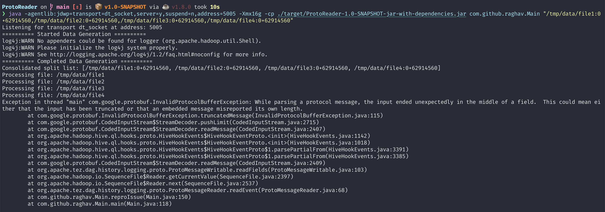
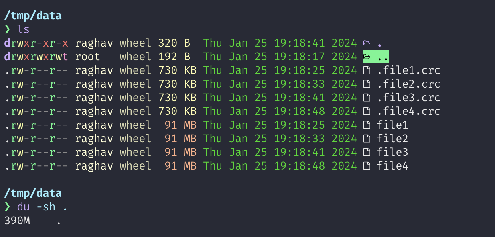
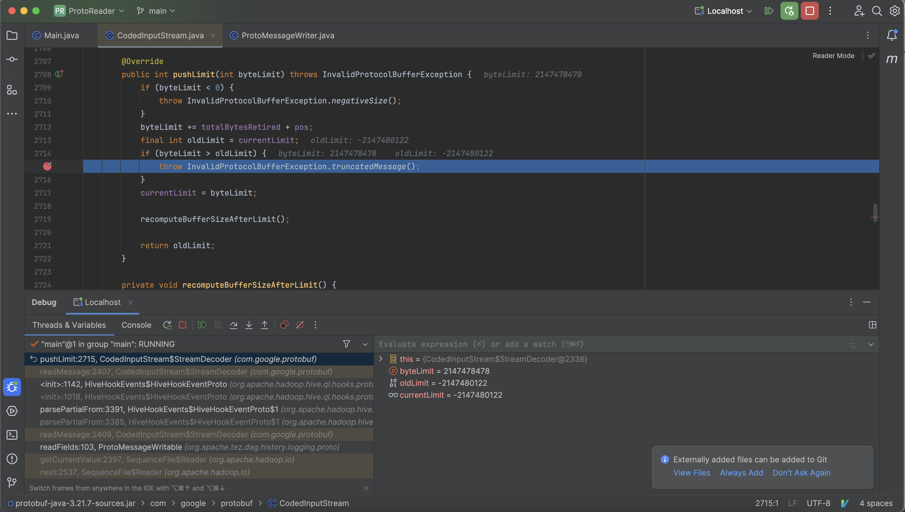

# To Build the jar
```bash
mvn clean install
```

# To run the program
```bash
java -Xmx16g -cp target/ProtoReader-1.0-SNAPSHOT-jar-with-dependencies.jar com.github.raghav.Main "/tmp/data/file1:0+62914560,/tmp/data/file2:0+62914560,/tmp/data/file3:0+62914560,/tmp/data/file4:0+62914560"
```

# NOTE
<p>
Its takes around 15-20 min to run the test. To improve the execution time, play with proto message builder :-)
</p>

# Error message


# Generated Data


# While Debugging


